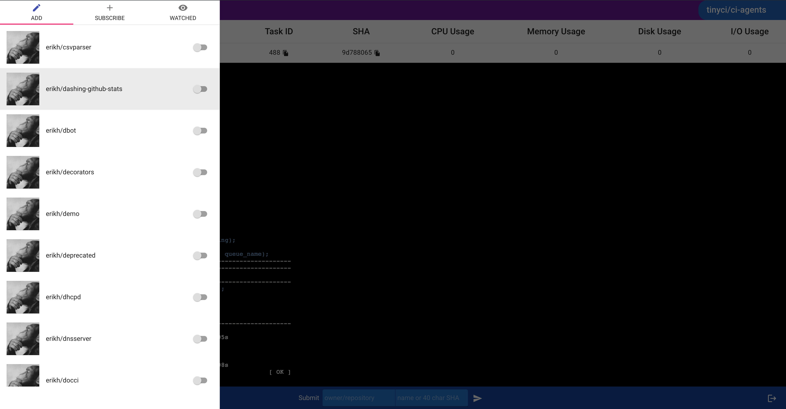

# tinyCI's Agents

This repository contains most of tinyci's microservices as well as its
command-line client, `tinycli`.

To get a tinyCI release, head over to
https://github.com/tinyci/tinyci/releases. The rest of this page is largely
about developer setup. Check out our [docs](http://docs.tinyci.org) if you're
interested in using or testing out tinyCI.

## Developer Setup

Follow these instructions carefully. We will soon have something a little more
streamlined.

It is easiest to work with this project through the [Golang
Toolchain](https://golang.org). Get it before following these instructions.

```
$ export GOPATH=$HOME
$ go get -d github.com/tinyci/ci-agents
$ go get -d github.com/tinyci/ci-ui
$ cd ~/src/github.com/tinyci/ci-ui && make test-debug
$ cd ~/src/github.com/tinyci/ci-agents
$ cp .config/services.yaml.example .config/services.yaml
<edit services to taste>
$ make demo
```

Then hit port 3000 of that host on your browser. If you have configured OAuth,
you will be presented with a confirmation screen. If you are running in no auth
mode, you will be teleported to the UI directly.

### Configuring it

To start, it's easiest to configure one task at the root with multiple runs.
Later on, you will want to isolate directories with additional `task.yml` files
so subsections of your code can be tested independently of each other.

Put this in a file named `task.yml` at the root:

```yaml
---
mountpoint: '/build' # this is where your source will be mounted in the image
runs:
  testbuild: # name of the run
    command: ['do', 'build'] # customize this to taste
    image: 'ubuntu:18.04' # example! Use any image you'd like.
  test: # name of the run
    command: ['do', 'test'] # customize this to taste
    image: 'ubuntu:18.04' # example! Use any image you'd like.
```

As well as creating an empty `tinyci.yml` -- this file typically contains
global overrides and is always read from the master branch. For now,
customizing it is not necessary.

To add your repository to tinyCI, click the hamburger menu at the top left of
the UI, then select the `Add` tab and find your repository. Check the box; the
hook will be set up automatically in a secured fashion.



After that, you can submit code through the Manual Submission dialog or any
push or pull request will also trigger a CI run. Enjoy!

Please note that actually running your code requires that you launch a runner
(ideally on a separate server) which is covered in our [documentation](https://docs.tinyci.org).

## License

TBD
